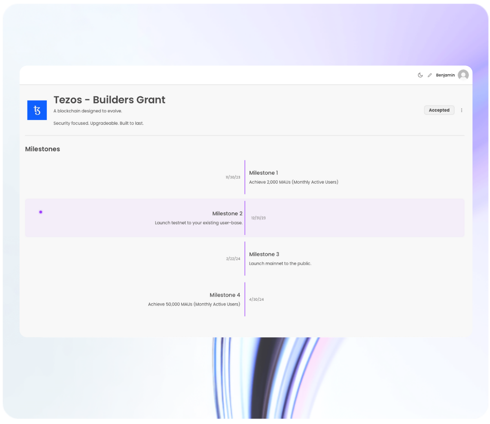

# 📗 Fundraising Nexus

## _Introducing the_ Fundraising Nexus

One centralised platform to track, analyse and review your managed grant/s, with Granted.\
Something, that we regard, as the natural next step in Web3 fundraising efficiency.



## Core Features

### Milestone management

<figure><figcaption></figcaption></figure>

Manage, understand and track the milestones - that we negotiate for you - with the in-built milestone tracker, featured in the Granted portal.

### Application status

Get an audit trail of your SDLC from requirements, to development, to testing & deployment.

<figure><figcaption></figcaption></figure>

### Centralised analytics

Message your team, grant programs and Granted customer success agents - to align on

<figure><figcaption></figcaption></figure>

### Stay tuned for a detailed guide, coming soon!

